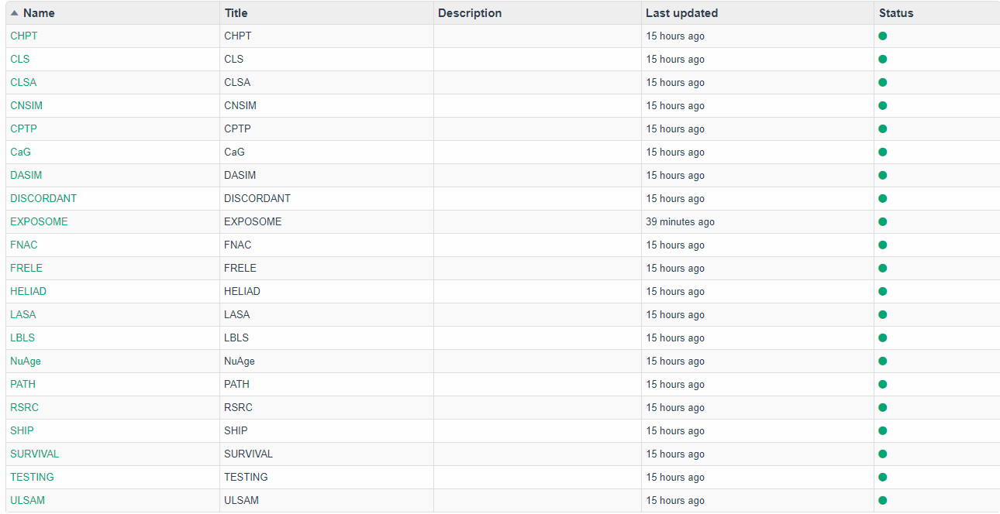
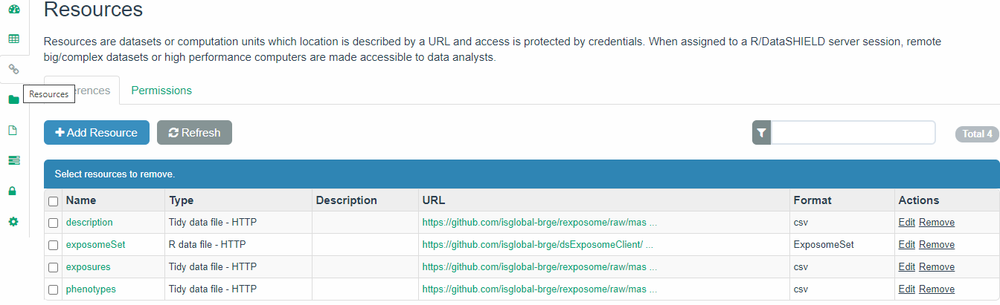

```{r setup, include=FALSE}
BiocStyle::markdown()
options(width=80)
knitr::opts_chunk$set(comment="", warning=FALSE, message=FALSE, cache=FALSE)
```

# Introduction

Sharing data across studies that are subject to confidentiality and must comply with data protection regulations is
a challenging task. [DataSHIELD](http://www.datashield.ac.uk/) is a software solution for secure biomedicine
collaboration that allows privacy-protected data analysis of federated databases. It enables the remote and non-disclosive
analysis of sensitive research data, and has been developed under several EC projects (BioSHaRE-EU,
InterConnect, LifeCycle, EUCAN-Connect). So far, DataSHIELD includes an extensive set of disclosure-protected
functions for data manipulation, exploratory data analytics, generalised linear modelling and data visualizations.
Here, we have extend DataSHIELD tools by incorporating new functionalities to deal with exposome data
visualization and association analysis. We also illustrate how to integrate omics information with exposome data.


[Opal](http://opaldoc.obiba.org/en/latest/) is [OBiBa](https://www.obiba.org/)’s core database application for epidemiological studies. Participant data, collected by questionnaires, medical instruments, sensors, administrative databases etc. can be integrated and stored in a central data repository under a uniform model. Opal is a web application that can import, process, copy data and has advanced features for cataloging the data (fully described, annotatted and searchable data dictionaries). Opal is typically used in a research center to analyze the data acquired at assessment centres. Its ultimate purpose is to achieve seamless data-sharing among epidemiological studies. Opal is the reference implementation of the DataSHIELD infrastructure.  

Developing and implementing new algorithms to perform advanced data analyses under DataSHIELD framework is a current active line of research. However, the analysis of big data within DataSHIELD has some limitations. Some of them are related to how data is managed in the Opal’s database and others are related to how to perform statistical analyses of big data within the R environment. Opal databases are for general purpose and do not properly manage large amounts of information and, second, it requires moving data from original repositories into Opal which is inefficient (this is a time, CPU and memory consuming operation) and is difficult to maintain when data are updated. We have recently overcome the problem related to DataSHIELD big data management by developing a new data infrastructure within Opal: [the resources](https://isglobal-brge.github.io/resource_bookdown/resources.html). In this [bookdown](https://isglobal-brge.github.io) the reader can learn a bit more about Opal, DataSHIELD and other releated issues. 

This new infrastructure allow us, among others, the analysis of exposome data since we can define a resource as an `ExposomeSet` an specific method to [encapsulate exposome data](https://www.bioconductor.org/packages/release/bioc/vignettes/rexposome/inst/doc/exposome_data_analysis.html)) in R.   

For those who are not familiar with Opal servers and do not know how to create this infrastructure, we recommend to read [this section](https://isglobal-brge.github.io/resource_bookdown/tips-and-tricks.html) from our bookdown.

## Exposome data in a demo Opal server

We have created an  [Opal demo server](https://opal-demo.obiba.org/) that contains different projects, including one called EXPOSOME, as we can see in the next figure



The Opal server can be accessed with the credentials:

- username: `administrator`
- password: `password`


The EXPOSOME project contains 4 resources. One `ExposomeSet` object and three other .csv files containing required data for exposome studies: exposome data, exposome annotation and phenotype information. 




Therefore, we will assume that the user will have either an `ExposomeSet` object or different text/Excel files having exposome data. Next, we illustrate how to perform the main analyses using `ds.Exposome` and `ds.ExposomeClient` packages. 

## Loading the Exposome Set

```{r include = FALSE}
download.file("https://github.com/isglobal-brge/dsExposomeClient/raw/master/vignette/loading_data.Rmd", paste0(dirname(rstudioapi::getActiveDocumentContext()$path), "/chapter1/loading_data.Rmd"))
```

```{r child='/chapter1/loading_data.Rmd', include=TRUE}
```

### From tables to `ExposomeSet`

```{r include = FALSE}
download.file("https://github.com/isglobal-brge/dsExposomeClient/raw/master/vignette/tables_to_exposome.Rmd", paste0(dirname(rstudioapi::getActiveDocumentContext()$path), "/chapter1/tables_to_exposome.Rmd"))
```

```{r child='/chapter1/tables_to_exposome.Rmd', include=TRUE}
```

### From resource to `ExposomeSet`

```{r include = FALSE}
download.file("https://github.com/isglobal-brge/dsExposomeClient/raw/master/vignette/resource_to_exposome.Rmd", paste0(dirname(rstudioapi::getActiveDocumentContext()$path), "/chapter1/resource_to_exposome.Rmd"))
```

```{r child='/chapter1/resource_to_exposome.Rmd', include=TRUE}
```

## Exploring the loaded dataset

```{r include = FALSE}
download.file("https://github.com/isglobal-brge/dsExposomeClient/raw/master/vignette/exploring_dataset.Rmd", paste0(dirname(rstudioapi::getActiveDocumentContext()$path), "/chapter1/exploring_dataset.Rmd"))
```

```{r child='/chapter1/exploring_dataset.Rmd', include=TRUE}
```

### Family names

```{r include = FALSE}
download.file("https://github.com/isglobal-brge/dsExposomeClient/raw/master/vignette/family_names.Rmd", paste0(dirname(rstudioapi::getActiveDocumentContext()$path), "/chapter1/family_names.Rmd"))
```

```{r child='/chapter1/family_names.Rmd', include=TRUE}
```

### Exposures and phenotypes names

```{r include = FALSE}
download.file("https://github.com/isglobal-brge/dsExposomeClient/raw/master/vignette/exp_pheno_names.Rmd", paste0(dirname(rstudioapi::getActiveDocumentContext()$path), "/chapter1/exp_pheno_names.Rmd"))
```

```{r child='/chapter1/exp_pheno_names.Rmd', include=TRUE}
```

### Summary of variables

```{r include = FALSE}
download.file("https://github.com/isglobal-brge/dsExposomeClient/raw/master/vignette/summary_variables.Rmd", paste0(dirname(rstudioapi::getActiveDocumentContext()$path), "/chapter1/summary_variables.Rmd"))
```

```{r child='/chapter1/summary_variables.Rmd', include=TRUE}
```

### Missing data

```{r include = FALSE}
download.file("https://github.com/isglobal-brge/dsExposomeClient/raw/master/vignette/missing_data.Rmd", paste0(dirname(rstudioapi::getActiveDocumentContext()$path), "/chapter1/missing_data.Rmd"))
```

```{r child='/chapter1/missing_data.Rmd', include=TRUE}
```

### Exposures Normality

```{r include = FALSE}
download.file("https://github.com/isglobal-brge/dsExposomeClient/raw/master/vignette/exposures_normality.Rmd", paste0(dirname(rstudioapi::getActiveDocumentContext()$path), "/chapter1/exposures_normality.Rmd"))
```

```{r child='/chapter1/exposures_normality.Rmd', include=TRUE}
```

### Exposures Behaviour

```{r include = FALSE}
download.file("https://github.com/isglobal-brge/dsExposomeClient/raw/master/vignette/exposures_behaviour.Rmd", paste0(dirname(rstudioapi::getActiveDocumentContext()$path), "/chapter1/exposures_behaviour.Rmd"))
```

```{r child='/chapter1/exposures_behaviour.Rmd', include=TRUE}
```

## Exposures Imputation

```{r include = FALSE}
download.file("https://github.com/isglobal-brge/dsExposomeClient/raw/master/vignette/exposures_imputation.Rmd", paste0(dirname(rstudioapi::getActiveDocumentContext()$path), "/chapter1/exposures_imputation.Rmd"))
```

```{r child='/chapter1/exposures_imputation.Rmd', include=TRUE}
```

## Performing an ExWAS

```{r include = FALSE}
download.file("https://github.com/isglobal-brge/dsExposomeClient/raw/master/vignette/exwas.Rmd", paste0(dirname(rstudioapi::getActiveDocumentContext()$path), "/chapter1/exwas.Rmd"))
```

```{r child='/chapter1/exwas.Rmd', include=TRUE}
```

## Exposures PCA

```{r include = FALSE}
download.file("https://github.com/isglobal-brge/dsExposomeClient/raw/master/vignette/pca.Rmd", paste0(dirname(rstudioapi::getActiveDocumentContext()$path), "/chapter1/pca.Rmd"))
```

```{r child='/chapter1/pca.Rmd', include=TRUE}
```

## Exposures Correlation

```{r include = FALSE}
download.file("https://github.com/isglobal-brge/dsExposomeClient/raw/master/vignette/correlation.Rmd", paste0(dirname(rstudioapi::getActiveDocumentContext()$path), "/chapter1/correlation.Rmd"))
```

```{r child='/chapter1/correlation.Rmd', include=TRUE}
```